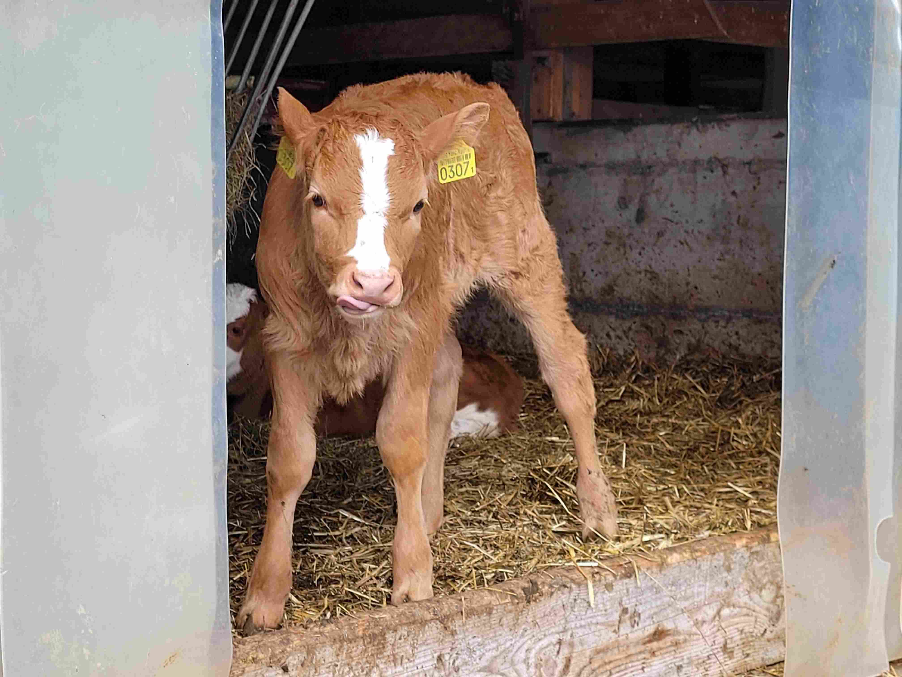
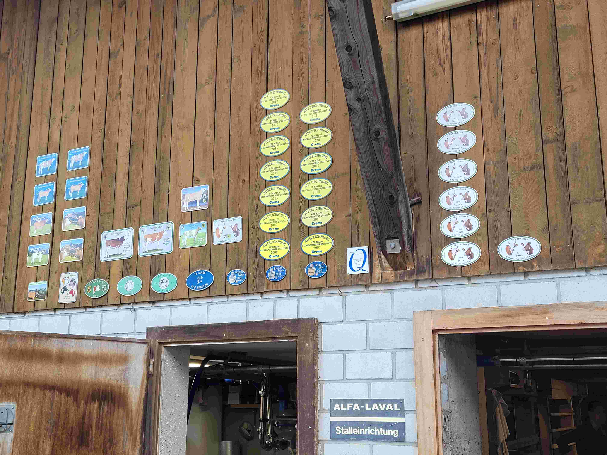

+++
title = "Biobauernhöfe blicken in die Zukunft und erzählen von der Vergangenheit "
date = "2023-06-15"
draft = false
pinned = true
tags = []
image = ""
description = ""
footnotes = ""
+++
### Bio Produkte werden geschätzt und gefordert, doch was steckt hinter der Produktion? Wir haben zwei Bauernhöfe erforscht und bieten euch einen Einblick in die Biolandwirtschaft und ihre Sonnen- und Schattenseiten.  

 Die Sonnenstrahlen haben ihren Weg ins Tal gefunden, alles blüht und die Tiere freuen sich auf die saftig grünen Weiden. Es muhen die Kühe und manchmal hört man den Hofhund bellen. Von aussen unterscheiden sich die Biohöfe kaum von konventionellen Betrieben. 

Zwei verschiedene Bauernhöfe, einer mitten im sonnigen Dorf Habkern von Ueli Brunner und einer etwas abgelegen bei Interlaken Ost an der Aare, der im Besitz von Ueli Balmer ist. Beide betreiben einen Biohof und beide produzieren hauptsächlich Milch. In Habkern stehen die Kühe gerade im Stall und werden gemolken, die Melkmaschine surrt im Hintergrund. Draussen toben sich mehrere Jungrinder auf der Wiese aus. In Interlaken sind die Kühe am Grasen auf der Weide. Die Jungtiere strecken neugierig ihre Köpfe aus dem Stall, doch eine unruhige Bewegung und schon hüpfen sie zurück. 

Bio ist eine Art von Landwirtschaft und ein Label, das Höfe und Produkte zertifiziert. Die Idee von Bio ist, in Kreisläufen zu arbeiten und somit nachhaltige, gesunde, lokale und hochwertige Produkte zu produzieren. Der Fokus liegt dabei nicht nur auf der Produktion von Konsumgütern, sondern es geht dabei genauso um Tierwohl, die Pflanzen, die Biodiversität und die Erhaltung der Schweizer Böden. Diese Ziele werden in den Richtlinien von Bio Suisse definiert, welche meist strenger sind als die Richtlinien für konventionelle Höfe. Beispielsweise sind für Biohöfe bestimmte Düngemittel verboten, was eine manuelle Entfernung von Blaken erfordert. Weiter ist es auch verboten, mit bestimmten Pestiziden die Kartoffeln gegen den Kartoffelkäfer zu besprühen. Ein Hof muss die Vorschriften von Bio Suisse einhalten, was auch jährlich kontrolliert wird, damit der Hof die Bio-Zertifizierung erhält. Ueli Balmer verdeutlicht ein Teil des Kontrollsystems so: “Im Bio müssen wir nicht einen höheren Prozentsatz an Ökofläche haben, aber die Vielfältigkeit ist wichtig. Also, dass man zum Beispiel auch Vogelhäuser aufstellt, dass man Nistmöglichkeiten hat auf dem Betrieb. Alles dies sind Kriterien, die bei Bio mit Punkten belohnt werden.” Bio fokussiert sich also auf die Interessen von Natur, Tier und Mensch.

Ein grosses Thema ist natürlich der Klimawandel. Durch den Klimawandel werden viele Änderungen nötig, besonders in Bezug auf die Nachhaltigkeit. Von Bio-Landwirtschaft wird ein höherer Standard erwartet als von konventioneller Landwirtschaft. Da auch in der konventionellen Landwirtschaft die Vorschriften sich immer mehr auf Nachhaltigkeit fokussieren, werden die Bio-Vorschriften ebenfalls strenger werden. Ein Kernthema der Nachhaltigkeit ist der Fleischkonsum. Es ist ein umstrittenes Thema, jedoch meinten beide Landwirte, dass der Konsum vermutlich sinken wird. Ein sinkender Fleischkonsum wird auf die gesamte Landwirtschaft und auf sie als Milchproduzenten einen Einfluss haben, doch wie genau, wird nur die Zukunft zeigen. Ewas wichtiges, besonders in einem solch kleinen Land wie der Schweiz, ist die Selbstversorgung. Ein Selbstversorgungsgrad von 100 Prozent ist, wenn ein Land genug produziert, um die eigene Bevölkerung komplett selbst zu ernähren. In der Schweiz jedoch liegt der Selbstversorgungsgrad nur bei etwa 50 Prozent aller Nahrungsmitteln. Ein Fokus in Zukunft sollte also sein, den Selbstversorgungsgrad zu erhöhen. Ein höherer Selbstversorgungsgrad gibt Sicherheit im Falle einer Krise, weil man weniger abhängig ist vom globalen Markt. Weiterhin müsste auch weniger importiert werden, was zu weniger Emissionen führt. 

Bio wird immer mehr gefordert, jedoch liegt der Marktanteil bei nur 11 Prozent. Nur etwa 20 Prozent der Schweizer kaufen häufig Bio-Produkte. Ein Bauer kann kein Produkt verkaufen, wofür es keine Nachfrage gibt. Alle würden nach Bio schreien, meint der Bauer Balmer-Müllener aus Interlaken, aber nur die Wenigsten würden tatsächlich Bio einkaufen. Das heisst, wer mehr Bio-Produkte fordere, solle auch mehr Bioprodukte kaufen, sonst würde sich nichts ändern.  “lm vorherigen Jahr sind viele Betriebe auf Bio umgestiegen», erklärt Ueli Brunner nachdenklich «Daraufhin habe ich ein Schreiben von meinem Milchabnehmer erhalten, in dem stand, dass den neuen Biobetrieben die Milch nicht als Bio abgenommen wird, sondern noch weiterhin als konventionell, weil ein Überangebot herrscht und man das Bioprodukt nicht mehr absetzen kann.” Der generelle Trend von Bio in Konsum, Marktanteil und Anzahl Höfen ist definitiv steigend, wenn in den letzten Jahren auch nur leicht. 

Auf sogenannten Knospe-Höfen müssen die Tiere gemäss der RAUS-Verordnung regelmässig Auslauf erhalten. Konkret heisst das, während der Vegetationszeit mindestens 26-mal im Monat auf der Weide und während dem Winter 13-mal im Monat im Laufhof. Wenn ein Stall Anbindehaltung hat, wird umso mehr Wert auf regelmässigen Auslauf gelegt.

Bio Suisse möchte möglichst gesunde Tiere unter ihrem Label haben, dies soll mit möglichst wenig Medikamenten, viel Auslauf und Biofütterung erzielt werden. Obwohl der Einsatz von Antibiotika so viel wie möglich reduziert wird, ist der Einsatz auf Biobauernhöfen nicht verboten. Jedoch dürfen Antibiotika nur als Notfallmedikament eingesetzt werden, aber strenge Vorschriften gelten trotzdem. Wenn ein Tier mehr als drei Behandlungen pro Kalenderjahr hatte, verliert dieses den Biostatus. Bei Tieren, die jünger als ein Jahr sind, ist nur eine Behandlung erlaubt. Das ist nur eine der vielen Einschränkungen, welche Bio Suisse vertritt. Die Meinungen darüber unterscheiden sich stark. Schliesslich soll das Tier möglichst unberührt sein, da alles, was im Tier war, auch in dessen Milch oder Fleisch wiedergefunden werden kann. Aber ist uns das Bio Label mehr wert als die Behandlung kranker Tiere?

Die Schweiz hat viele verschiedene Regionen und das Klima variiert, von den Gipfeln der Schweizeralpen bis ins Mittelland. Das hat verschiedene Auswirkungen auf die Landwirtschaft. Die Weiden sind oft unzugänglicher in den Bergen als in flacheren Gebieten, mit den Worten von Ueli Brunner: “Es ist mehr Man oder Woman power gefragt als talwärts.” Das Wetter und das Klima sind ganz anders. Im Oberland ist die Vegetationszeit kürzer, durch die höhere Lage und die tieferen Temperaturen. Die Zusammensetzung des Grases und Heu ist anders, da andere Pflanzen, Gräser und Kräuter wachsen. Im Mitteland ist der Ackerbau viel leichter zu betreiben als in den Alpen.  Schon nur das Terrain, das viel flacher und zugänglicher ist, aber auch das Klima ist angepasster und das Wachstumsfenster ist grösser. Das heisst aber nicht, dass die Landwirtschaft in den Alpen keine Zukunft hat, ganz im Gegenteil. Für das Vieh sind weder die kälteren Temperaturen noch die steilen Hänge ein Problem und der Ackerbau, ist auch ertragreich.

Obwohl man von aussen den Unterschied von Bio zu Konventionell nicht direkt sieht, ist er doch entscheidend. Sie hilft uns mit der Natur und deren Tiere im Einklang zu bleiben. Die Natur hilft uns, und nun helfen wir ihr.